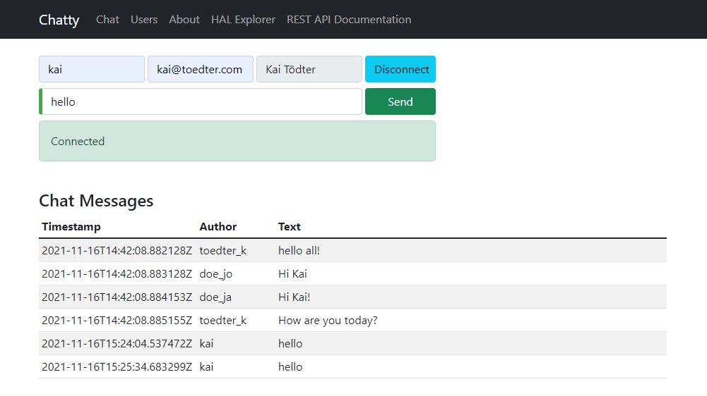

[[chatty-build-status]]
= Chatty

image:https://travis-ci.com/toedter/chatty.svg?branch=master[Build Status, link="https://travis-ci.com/toedter/chatty"]
image:https://img.shields.io/badge/license-MIT-blue.svg["MIT", link="http://toedter.mit-license.org"]

A chat demo that evaluates several technologies (and hopefully shows best practices)

[[used-technologies]]
== Used Technologies

* Java >= 8
* http://projects.spring.io/spring-boot/[Spring Boot] (+ Spring Data REST & REST Docs)
* http://stateless.co/hal_specification.html[HAL] (Hypertext Application Language)
* https://github.com/Atmosphere/atmosphere[Atmosphere] (Async Pub/Sub)
* http://www.typescriptlang.org/[TypeScript] for web client
* http://angular.io/[Angular] for web client
* https://github.com/angular/protractor[Protractor] for functional web client UI tests
* http://junit.org/[JUnit] for Java unit and integration testing
* https://code.google.com/p/mockito/[Mockito] for Mocking
* http://www.gradle.org/[Gradle] as build system
* https://www.docker.com[Docker] to create containers for the running apps

[[requirements]]
== Requirements

* Java 8 JDK (or later) installed
* JavaScript tooling like Node.js, Grunt CLI, Bower and TSD (TypeScript Definition Manager) doesn't have to be
installed manually, it will be installed automatically (and project local) during the Gradle build.

[[getting-started]]
== Getting Started

* ./gradlew build (builds all, both Java and TypeScript)
* ./gradlew bootrun (starts a server using port 8080)
* Open http://localhost:8080 in a web browser
* Open http://localhost:8080 in another web browser
* Play around with Chatty!

[[screenshot]]
== Screenshot

[[hypermedia-api]]
== Hypermedia API

Here is an example what you get at
http://localhost:8080/api/users. I am using
http://stateless.co/hal_specification.html[HAL] (Hypertext Application Language). The returned mime type is
*application/hal+json*. To get a pretty print in Chrome, please
install the Chrome extensions 
https://chrome.google.com/webstore/detail/jsonview/chklaanhfefbnpoihckbnefhakgolnmc[JSONView]
and
https://chrome.google.com/webstore/detail/application%20json%20xml-as-i/cgfnklamhhieaepdicnbahkbnolpbdmp[application/…+json|+xml as inline].

[source,json]
{
  "_embedded" : {
    "chatty:users" : [ {
      "fullName" : "Jane Doe",
      "email" : "jane@doe.com",
      "_links" : {
        "self" : {
          "href" : "http://localhost:8080/api/users/doe_ja"
        },
        "chatty:user" : {
          "href" : "http://localhost:8080/api/users/doe_ja{?projection}",
          "templated" : true
        },
        "chatty:messages" : {
          "href" : "http://localhost:8080/api/users/doe_ja/messages"
        }
      }
    } ]
  }
}

[[spring-boot]]
== Spring Boot

To run the Spring-Boot based server, invoke gradlew bootrun

Then you can use http://localhost:8080/api as entry point for
exploring the HAL based API.

[source, json]
{
  "_links": {
    "chatty:users": {
      "href": "http://localhost:8080/api/users{?page,size,sort,projection}",
      "templated": true
    },
    "chatty:messages": {
      "href": "http://localhost:8080/api/messages{?page,size,sort,projection}",
      "templated": true
    },
    "chatty:buildinfo": {
      "href": "http://localhost:8080/api/buildinfo"
    },
    "profile": {
      "href": "http://localhost:8080/api/profile"
    },
    "curies": [
      {
        "href": "http://localhost:8080/api/../docs/{rel}.html",
        "name": "chatty",
        "templated": true
      }
    ]
  }
}

[[hal-browser]]
== HAL Browser

After having started the Spring Boot based server, you can use
http://localhost:8080/api/hal-browser/browser.html#/api/[http://localhost:8080/api/hal-browser/browser.html#/api/]
as entry point for exploring the HAL based API with the embedded
HAL-Browser.

[[hal-explorer]]
== HAL Explorer Integration

Additionally to the HAL-browser, you can build and integrate the https://github.com/toedter/hal-explorer[HAL Explorer].
Then you have to invoke
./gradlew build cloneHalBrowser
./gradlew -p subprojects/hal-browser build

[[live-demo]]
== Live Demo

Currently the Spring Boot based server is deployed to Heroku.
You can try out a live demo of chatty at

* https://chatty42.herokuapp.com/

The demos include a HAL browser for browsing Chatty's RESTful hypermedia API, as well
as documentation of the REST API created with Spring Restdocs.
But please be aware
that this is only a test installment and will be reset periodically.

[[docker-integration]]
== Docker Integration

You find installation instructions at https://www.docker.com[Docker].
When you use Windows or MAC, install https://www.docker.com/docker-toolbox[Docker Toolbox].
To prepare the docker image creation you have to run 'gradlew build createDockerfile distTar'.
Under Windows and MAC you want to create a VM with docker-machine and connect to it.
Then you can create the images and start up a container for
the Spring Boot based service (running on port 8080)
by invoking: docker-compose up

[[pebble-client]]
== Pebble Client

* For a Pebble client, see https://github.com/toedter/pebble-chatty

[[license]]
== License

MIT, see http://toedter.mit-license.org
