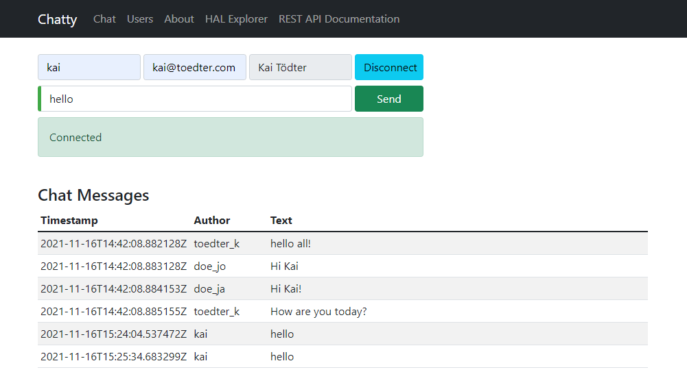

chatty [](https://travis-ci.org/toedter/chatty)
======

chatty - a chat demo that evaluates several technologies (and hopefully shows best practices)

Used Technologies
-----------------
* Java 8 (This demo will not run with any Java < 8)
* [HAL] (http://stateless.co/hal_specification.html) (Hypertext Application Language)
* [Atmosphere] (https://github.com/Atmosphere/atmosphere) (Async Pub/Sub)
* [Jersey] (https://jersey.java.net/) (JAX-RS reference implementation)
* [Spring Boot] (http://projects.spring.io/spring-boot/) (+ Data, REST, HATEOAS)
* [TypeScript] (http://www.typescriptlang.org/) for web client
* [AngularJS] (http://angularjs.org/) for web client
* [Protractor] (https://github.com/angular/protractor) for functional web client UI tests
* [JUnit] (http://junit.org/) for Java unit and integration testing
* [Mockito] (https://code.google.com/p/mockito/) for Mocking
* [Gradle] (http://www.gradle.org/) as build system
* [Docker] (https://www.docker.com) to create containers for the running apps

Requirements
------------
* Java 8 JDK installed
* Node.js installed
* Grunt CLI installed (npm install -g grunt-cli)
* Bower and TSD (TypeScript Definition Manager) don't have to be installed, the build will invoke the grunt contribs for bower and tsd

Getting Started
---------------
* ./gradlew build (builds all and runs the integration tests, both Java and TypeScript)
* ./gradlew startServerSync (starts a Jetty server using port 8080)
* Open [http://localhost:8080/src/main/webapp/chatty.html](http://localhost:8080/src/main/webapp/chatty.html) in a web browser
* Open [http://localhost:8080/src/main/webapp/chatty.html](http://localhost:8080/src/main/webapp/chatty.html) in another web browser
* Play around with chatty!

Screenshot
----------


Hypermedia API
--------------
Here is an example what you get at [http://localhost:8080/chatty/api/users](http://localhost:8080/chatty/api/users). Currently I am using [HAL] (http://stateless.co/hal_specification.html). The returnd mime type is "application/hal+json". To get a pretty print in Chrome, please install the Chrome extensions [JSONView] (https://chrome.google.com/webstore/detail/jsonview/chklaanhfefbnpoihckbnefhakgolnmc) and ["application/...+json|+xml as inline"](https://chrome.google.com/webstore/detail/application%20json%20xml-as-i/cgfnklamhhieaepdicnbahkbnolpbdmp)

```javascript
{
  _links: {
    self: {
      href: "http://localhost:8080/chatty/api/users",
      hreflang: "en",
      profile: "chatty"
    }
  },
  _embedded: {
    users: [
      {
         _links: {
           self: {
             href: "http://localhost:8080/chatty/api/users/toedter_k"
           }
         },
         email: "kai@toedter.com",
         fullName: "Kai Toedter",
         id: "toedter_k"
      }
    ]
  }
}
```

Spring Boot
------------
To run the Spring-Boot based server, invoke
gradlew bootrun

Then you can use [http://localhost:8080/chatty/api/](http://localhost:8080/chatty/api/) as entry point for exploring the HAL based API.

```javascript
{
  "_links" : {
    "chatty:users" : {
      "href" : "http://localhost:8080/chatty/api/users{?page,size,sort,projection}",
      "templated" : true
    },
    "chatty:messages" : {
      "href" : "http://localhost:8080/chatty/api/messages{?page,size,sort,projection}",
      "templated" : true
    },
    "profile" : {
      "href" : "http://localhost:8080/chatty/api/alps"
    },
    "curies" : [ {
      "href" : "http://localhost:8080/chatty/api/alps/{rel}",
      "name" : "chatty",
      "templated" : true
    } ]
  }
}
```

HAL Browser
------------
After having started the Spring Boot based server,
you can use [http://localhost:8080/chatty/api/hal-browser/browser.html#/api/](http://localhost:8080/chatty/api/hal-browser/browser.html#/chatty/api/)
as entry point for exploring the HAL based API with the embedded HAL-Browser.

Live Demo
---------
Currently the Spring Boot based server is deployed to Heroku. You can browse the Chatty API with the HAL browser at
[https://chatty42.herokuapp.com/hal-browser/browser.html#https://chatty42.herokuapp.com/chatty/api](https://chatty42.herokuapp.com/hal-browser/browser.html#https://chatty42.herokuapp.com/chatty/api).
You can also try out a live demo of chatty at
[https://chatty42.herokuapp.com/chatty/chatty.html](https://chatty42.herokuapp.com/chatty/chatty.html).
But please be aware that this is only a test installment and will be reset periodically.

Docker integration
------------------
For the gradle docker integration the [gradle-docker-plugin] (https://github.com/bmuschko/gradle-docker-plugin) is used.

#### Prepare boot2docker
Boot2docker must be installed. You find installation instructions at [boot2docker] (http://boot2docker.io/).
Start boot2docker.

#### Build the docker image and run it (create and start a docker container)
Open a new console and run the following

```bash
cd subprojects/com.toedter.chatty.server
gradle dockerBuildImage
```

After successful image creation, you will see an image id.
In the boot2docker console, type

```bash
docker images
```

You will see the newly created image. Then run the image:

```bash
ID=$(docker run -d -p 8080:8080 <imageId>)
```

Open a browser with the boot2docker IP address and Port 8080, e.g. [http://192.168.59.103:8080/src/main/webapp/chatty.html] (http://192.168.59.103:8080/src/main/webapp/chatty.html)

finally stop the container:

```bash
docker stop $ID
```

What's Next?
------------
* improved Docker integration

License
-------
MIT, see http://toedter.mit-license.org
